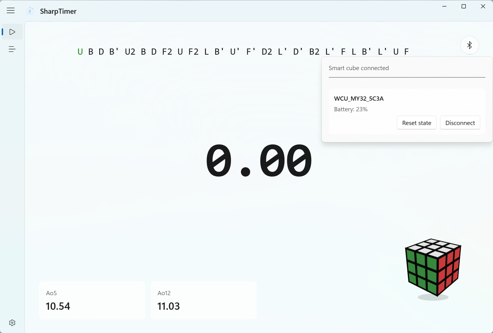

<h4 align="right">English | <strong><a href="README.md">简体中文</a></strong></h4>

  

  <h1>SharpTimer</h1>
    
  

    A native Windows speedcubing timer based on WinUI 3, with smart cube support
  

  

    
    
    
    
    
    
  

---

### Features

- Native Windows desktop experience, with the UI built on WinUI 3 / Windows App SDK
- Supports basic timing features such as spacebar timing, inspection, penalties, and solve session management
- Supports timing integration for Moyu32 series smart cubes, including smart scramble progression
- Provides light / dark themes, Mica / Mica Alt / Acrylic backdrop materials, and Chinese / English switching

### License

GPL-3.0

### Acknowledgements

- `WinUI-Gallery`: official WinUI Gallery examples, frontend reference
- `smartcube-web-bluetooth`: smart cube Bluetooth protocol reference
- `cstimer`: smart cube Bluetooth protocol and basic timing feature reference
