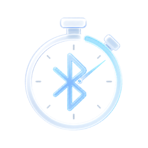
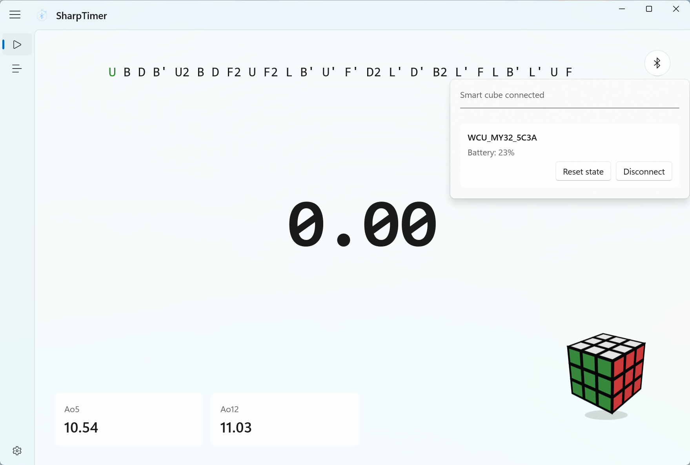

  

  <h1>SharpTimer</h1>

  

    支持智能魔方的 Windows 原生计时器
  

  

    <strong>中文</strong>
    ·
    <a href="README-en.md">English</a>
  

  

    
    
    
    
    
  

SharpTimer 是一个基于 .NET 8、WinUI 3 和 SQLite 的 Windows 原生魔方计时器，具有基本的计时功能，并且支持 Moyu32 系列智能魔方

### 预览

### 特点

- 原生 Windows 桌面体验，界面基于 WinUI 3 / Windows App SDK
- 支持空格计时、观察、判罚、成绩 session 管理等基础计时功能
- 已支持 Moyu32 系列智能魔方的计时接入（智能打乱推进）
- 提供亮/暗主题、Mica / Mica Alt / Acrylic 背景材质和中英切换

### 技术栈

| 分类 | 技术 |
| --- | --- |
| 客户端 | WinUI 3, Windows App SDK, XAML |
| 运行时 | .NET 8 |
| 语言 | C# |
| 存储 | SQLite |
| 蓝牙 | Windows BLE API |
| 测试 | xUnit |

### 致谢

- `ref/WinUI-Gallery`：官方 WinUI Gallery 示例，前端重要参考
- `ref/smartcube-web-bluetooth`：智能魔方蓝牙协议参考
- `ref/cstimer`：智能魔方蓝牙协议、基础计时功能参考
