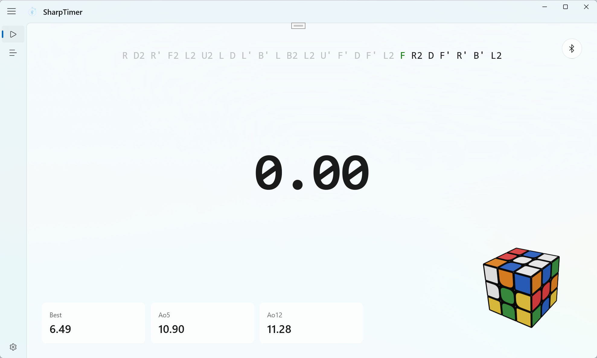
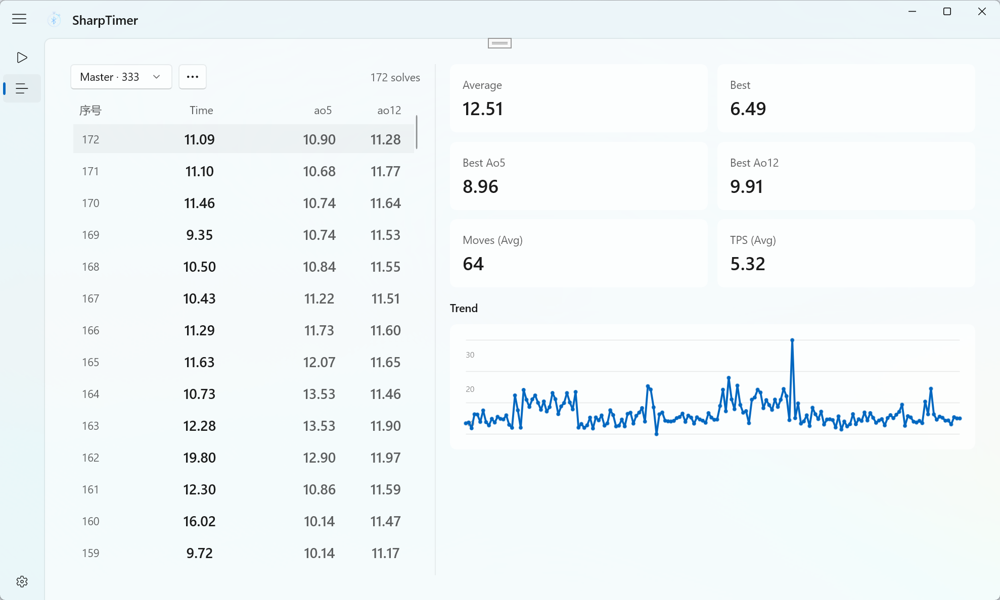
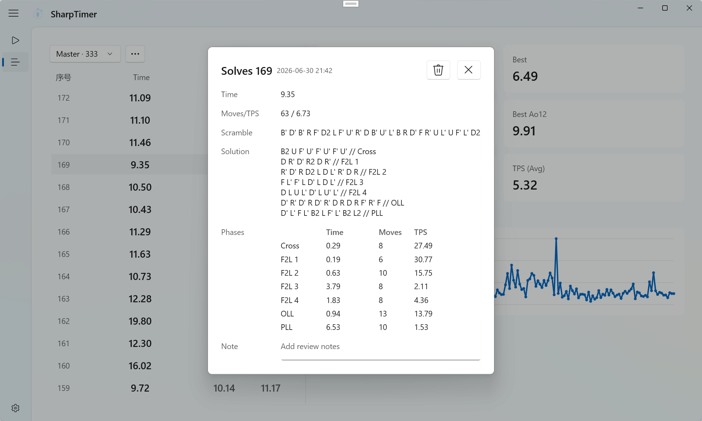
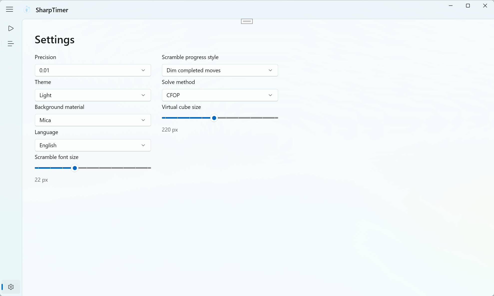

<h4 align="right"><strong><a href="README-en.md">English</a></strong> | 简体中文</h4>

  

  <h1>SharpTimer</h1>
    
  

    专为智能魔方打造的 WinUI 3 Windows 原生桌面计时器
  

  
  

    
    
    
    
    
    
  

<table>
  <tr>
    <td align="center"></td>
    <td align="center"></td>
  </tr>
  <tr>
    <td align="center"></td>
    <td align="center"></td>
  </tr>
</table>

---

### 特点

- 原生 Windows 桌面体验，界面基于 WinUI 3
- 功能轻量，只为智能三阶优化，无冗余功能
- 完整的智能魔方计时功能（Moves、TPS、解法、分段）
- 多品牌支持：MoYu、Gan、Qiyi

### 鸣谢

- `WinUI-Gallery`：官方 WinUI Gallery 示例，前端参考
- `smartcube-web-bluetooth`：智能魔方蓝牙协议参考
- `cstimer`：智能魔方蓝牙协议和相关算法参考
- `DCTimer-BLE`：智能魔方蓝牙协议和设计参考

### 许可证

GPLv3
